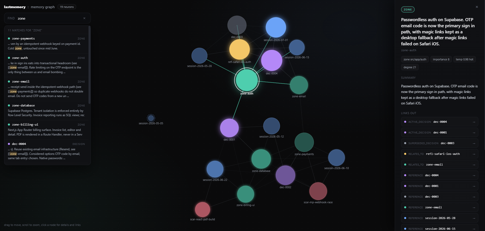

<p align="center">
  
</p>

<p align="center">
  
  
  
  
  
  
</p>

<p align="center">
  <b>Persistent, token efficient memory for coding agents.</b><br>
  A network of interconnected markdown files that remembers your project, anchored to the parts of your repo, and forgets what stops mattering.
</p>

---

## What it is

`lastmemory` is a memory skill for Claude Code, and for any CLI agent that can read markdown. It keeps a small `/memory` folder inside your project where knowledge lives as a network: each file is a neuron (a session, a zone of the repo, a decision, a failure, a reflection), and the links between files are synapses. The agent walks the links instead of loading everything, so it can recall a whole project history while paying for only a few hundred tokens.

It is built on four ideas:

1. **Spatial, not chronological.** Knowledge is anchored to parts of the repo (`auth`, `payments`), not to a flat log.
2. **A neural network of files.** Every file is a neuron; links are synapses. The agent navigates, it does not dump.
3. **Minimum token cost.** Layered loading (critical facts, then the index, then summaries, then full content). The whole context is never poured in. This is the headline, and we measure it.
4. **Memory that forgets.** An active consolidation pass called `dream` merges, compresses, supersedes and prunes. A brain that never forgets is useless.

<p align="center">
  
</p>

<p align="center"><i>Nodes colored by type, sized by connections, dimmed by temperature. Orphans get a dashed outline. A built in keyword search points to where each thing is documented, and every node panel has clickable links to walk the network. Generated fully offline from your markdown, no model and no network.</i></p>

## Quick start

1. Drop the `lastmemory/` folder into your Claude Code skills directory (or install it as a plugin).
2. In a project, run `/lastmemory on`. On first use it asks whether memory is shared with the team or personal, then creates the `/memory` folder and wires `.gitignore`.
3. Work as usual. When you want to save, run `/lastmemory`. It writes a session neuron, updates the zones you touched, and refreshes the index.
4. Next session, run `/lastmemory on` and get a two paragraph catch up: where you left off, and what to watch out for.
5. Every so often, run `/lastmemory dream` to consolidate, and `/lastmemory view` to open the graph.

## Commands

| Command | Action |
|---|---|
| `/lastmemory` | Save the current session. Automatic level. |
| `/lastmemory min` or `full` | Force the record level. |
| `/lastmemory on` | Session start. Loads the index and returns a catch up. |
| `/lastmemory remember <note>` | Mark something important mid session. |
| `/lastmemory ask "<question>"` | Query the network, answer with the cited source. |
| `/lastmemory dream` | Consolidate: merge, compress, supersede, forget. |
| `/lastmemory view` | Generate the offline HTML graph. |
| `/lastmemory status` | Brain health, and whether a dream is due. |
| `/lastmemory export` | Pack all of `/memory` into one portable markdown file. |
| `/lastmemory benchmark` | Measure token cost and regenerate the proof images. |

## How it works

**Loading layers, cheapest first.** `CRITICAL.md` (hard invariants, always loaded), then `BRAIN.md` (a one line per neuron index), then the `## Summary` of a neuron, then the full file only when it matters. Nothing loads eagerly.

**Five neuron types.** Sessions (what happened), zones (living state of a repo area), decisions (ADR style records of why), scars (failures and dead ends, with guardrails), reflections (patterns the `dream` pass finds across sessions).

**Retrieve then decide on save.** Instead of appending blindly, a save retrieves similar existing memory and chooses to add, update in place, supersede, or do nothing. Contradictions are superseded with a bitemporal model (when we learned it versus when it was true), never hard deleted.

**Temperature and forgetting.** Each neuron cools over time and reheats when used (`temperature = exp(-t / strength)`). Cold, low importance neurons get compressed during `dream`. The graph shows this as brightness.

**Scars have brakes.** Failure memory is powerful and risky: a wrong lesson can make an agent avoid a valid path forever. Every scar carries a confidence, a scope, and an expiry, and is re-validated over time.

## Token efficiency (measured, not claimed)

The point of `lastmemory` is to recall a whole project for a fraction of the context. `/lastmemory benchmark` runs a reproducible measurement on the bundled example project and writes the results to `benchmark/results/`.

<p align="center">
  
</p>

On the bundled example project (a memory of 19 neurons across 5 zones), catching up with `/lastmemory on` costs **1,435 tokens** versus **10,713** to dump every memory file, an **86.6% saving**. Counts are exact, produced with the tiktoken tokenizer. Lower is better.

The comparison is honest by rule: numbers and images only go in this README if they are true on the bundled scenario. The figure above is the saving against a full context dump baseline. Comparisons against the Anthropic memory tool flow and against the memory skills with the most stars on GitHub are measured the same way on the same scenario in the benchmark phase, and will be added here only once they are run and verified. See `benchmark/README.md` for the method.

## Example memory network

`example/memory/` is a complete sample brain for a fictional SaaS app called Orbit (Next.js, Supabase, MercadoPago). It shows every neuron type and a richly linked graph. Open it, or regenerate the graph with:

```
python lastmemory/scripts/generate_graph.py example/memory
```

Then open `example/memory/graph.html` in any browser.

## Design references

The mechanisms are borrowed openly from the current state of the art and adapted to plain markdown: retrieve then decide from mem0, the memory hierarchy and sleep time consolidation from Letta and MemGPT, the bitemporal supersede model from Zep and Graphiti, the recency plus importance plus relevance scoring and reflections from the Stanford Generative Agents, the `exp(-t/S)` forgetting curve from MemoryBank, progressive disclosure and the assume interruption protocol from Anthropic context engineering, and typed wikilinks from Basic Memory and A-MEM. Full design notes live in `lastmemory/references/`.

## About

<p align="left">
  
  
  
  
  
</p>

`lastmemory` is an open project. It fills a gap that neither opaque vector memory servers nor personal Obsidian second brains cover: engineering memory for a code repo, as an editable markdown graph, with an offline visualization and active forgetting. If you build agents or care about how they remember, contributions are welcome.

## Contributors

| | |
|---|---|
| [@uxKero](https://github.com/uxKero) | maintainer |
| Claude (Anthropic) | co author |

## License

MIT. See [LICENSE](LICENSE).
